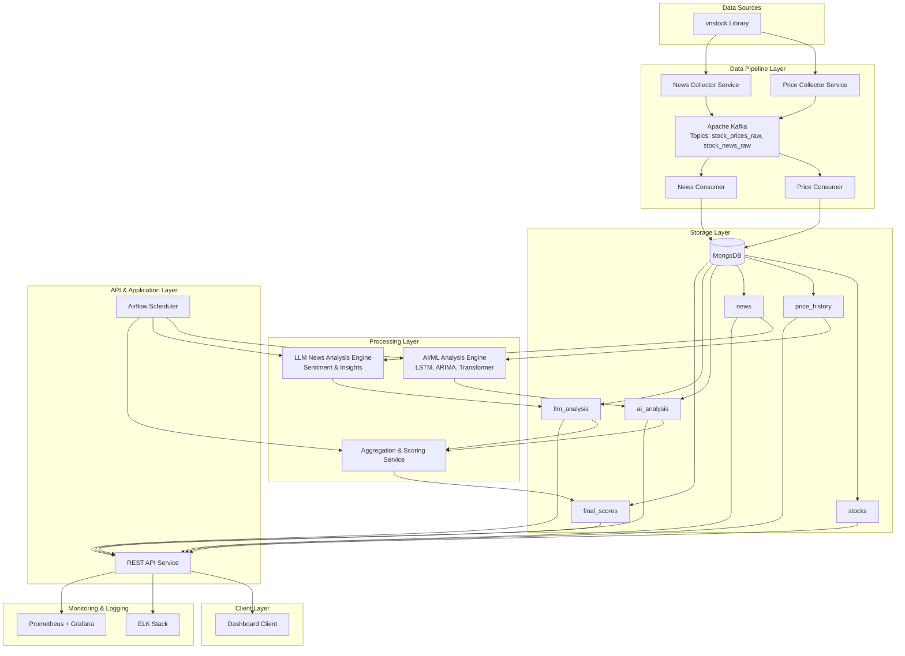
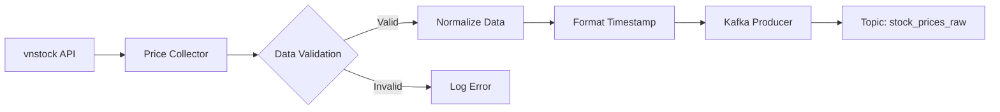
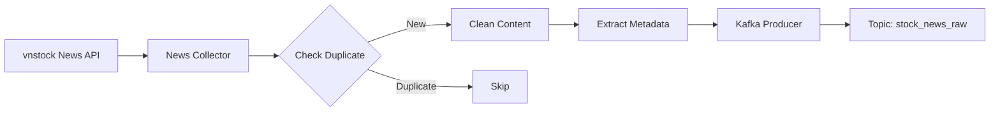
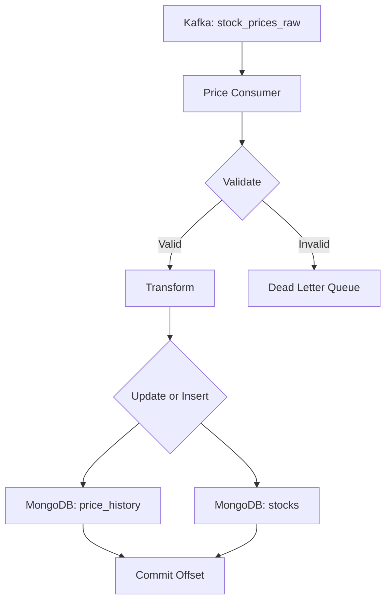
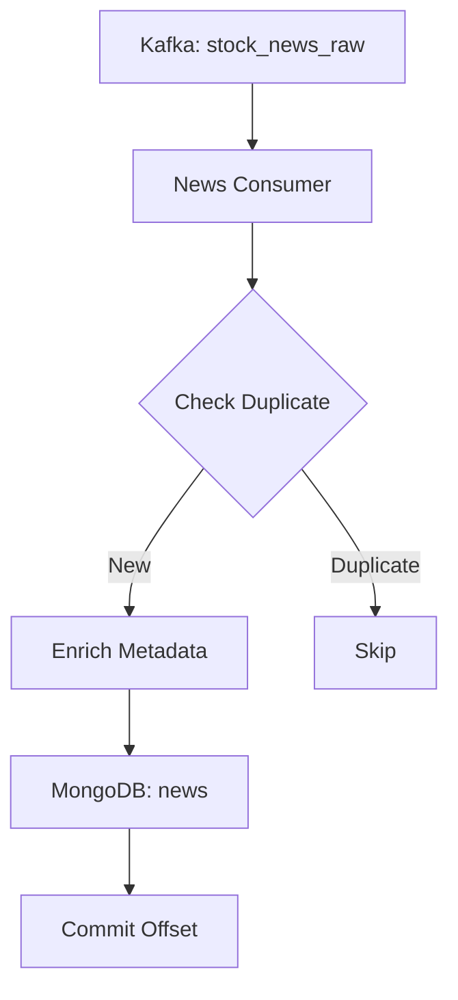
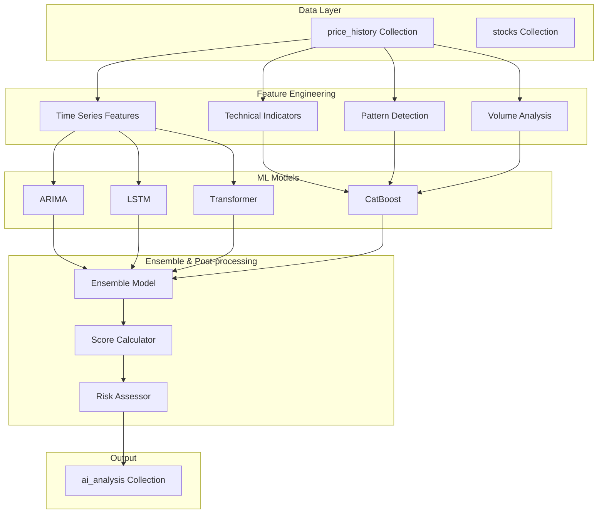

# Kế hoạch Thiết kế Hệ thống Backend - Nền tảng AI Gợi ý và Cảnh báo Cổ phiếu Việt Nam

## Mục lục
- [1. Kiến trúc Tổng thể](#1-kiến-trúc-tổng-thể)
- [2. Data Pipeline (ETL + Streaming)](#2-data-pipeline-etl--streaming)
- [3. AI/ML Analysis Engine](#3-aiml-analysis-engine)
- [4. LLM News Analysis Engine](#4-llm-news-analysis-engine)
- [5. Aggregation & Scoring Service](#5-aggregation--scoring-service)

---

## 1. Kiến trúc Tổng thể

### 1.1 High-Level System Architecture



### 1.2 Kiến trúc ASCII

```
┌─────────────────────────────────────────────────────────────────────┐
│                         DATA SOURCES LAYER                           │
│                        ┌──────────────────┐                          │
│                        │  vnstock Library │                          │
│                        └────────┬─────────┘                          │
└─────────────────────────────────┼─────────────────────────────────────┘
                                  │
┌─────────────────────────────────┼─────────────────────────────────────┐
│                    DATA PIPELINE LAYER                                │
│   ┌────────────────┐            │            ┌────────────────┐      │
│   │ Price Collector│◄───────────┴───────────►│ News Collector │      │
│   └───────┬────────┘                         └───────┬────────┘      │
│           │                                          │                │
│           │         ┌──────────────────┐            │                │
│           └────────►│   Apache Kafka   │◄───────────┘                │
│                     │  - stock_prices  │                              │
│                     │  - stock_news    │                              │
│                     └────────┬─────────┘                              │
│                              │                                        │
│           ┌──────────────────┴──────────────────┐                    │
│           │                                      │                    │
│   ┌───────▼────────┐                   ┌────────▼───────┐            │
│   │ Price Consumer │                   │ News Consumer  │            │
│   └───────┬────────┘                   └────────┬───────┘            │
└───────────┼──────────────────────────────────────┼───────────────────┘
            │                                      │
┌───────────┼──────────────────────────────────────┼───────────────────┐
│           │            STORAGE LAYER             │                   │
│           │      ┌────────────────────┐          │                   │
│           └─────►│                    │◄─────────┘                   │
│                  │      MongoDB       │                              │
│                  │                    │                              │
│                  │  ┌──────────────┐  │                              │
│                  │  │  stocks      │  │                              │
│                  │  │  price_hist  │  │                              │
│                  │  │  news        │  │                              │
│                  │  │  ai_analysis │  │                              │
│                  │  │  llm_analysis│  │                              │
│                  │  │  final_scores│  │                              │
│                  │  └──────────────┘  │                              │
│                  └─────────┬──────────┘                              │
└────────────────────────────┼──────────────────────────────────────────┘
                             │
┌────────────────────────────┼──────────────────────────────────────────┐
│              PROCESSING LAYER                                         │
│    ┌───────────────────────┴──────────────────────┐                  │
│    │                                               │                  │
│ ┌──▼────────────────┐  ┌───────────────────────┐  │                  │
│ │  AI/ML Engine     │  │  LLM News Engine      │  │                  │
│ │  - LSTM           │  │  - Sentiment Analysis │  │                  │
│ │  - ARIMA          │  │  - Insight Extraction │  │                  │
│ │  - Transformer    │  │  - Impact Assessment  │  │                  │
│ │  - CatBoost       │  └──────────┬────────────┘  │                  │
│ └────────┬──────────┘             │               │                  │
│          │                        │               │                  │
│          │  ┌─────────────────────▼───────┐       │                  │
│          └─►│ Aggregation & Scoring       │◄──────┘                  │
│             │ - Combine AI + LLM          │                          │
│             │ - Generate Final Scores     │                          │
│             │ - Create Alerts             │                          │
│             └──────────────┬──────────────┘                          │
└────────────────────────────┼──────────────────────────────────────────┘
                             │
┌────────────────────────────┼──────────────────────────────────────────┐
│                 API & APPLICATION LAYER                               │
│                  ┌─────────▼──────────┐                               │
│                  │   REST API Service │                               │
│                  │  - Stock endpoints │                               │
│                  │  - Alert endpoints │                               │
│                  │  - News endpoints  │                               │
│                  └─────────┬──────────┘                               │
│                            │                                          │
│                  ┌─────────▼──────────┐                               │
│                  │  Airflow Scheduler │                               │
│                  │  - Periodic Jobs   │                               │
│                  └────────────────────┘                               │
└────────────────────────────┬──────────────────────────────────────────┘
                             │
                    ┌────────▼─────────┐
                    │ Dashboard Client │
                    └──────────────────┘
```

### 1.3 Các thành phần chính

#### **Data Pipeline**
- Thu thập dữ liệu từ vnstock
- Xử lý streaming qua Kafka
- Lưu trữ vào MongoDB

#### **Kho dữ liệu (MongoDB)**
- Lưu trữ giá cổ phiếu, metadata
- Lưu trữ tin tức
- Lưu trữ kết quả phân tích AI/ML
- Lưu trữ kết quả phân tích LLM
- Lưu trữ điểm số cuối cùng và cảnh báo

#### **AI/ML Analysis Engine**
- Phân tích dữ liệu lịch sử giá
- Feature engineering (MA, RSI, MACD, candle patterns)
- Dự đoán xu hướng, đánh giá rủi ro
- Sử dụng ARIMA, LSTM, Transformer, CatBoost

#### **LLM News Analysis Engine**
- Phân tích tin tức từ vnstock
- Tóm tắt và sentiment analysis
- Đánh giá độ ảnh hưởng đến cổ phiếu
- Trích xuất insights quan trọng

#### **Aggregation & Scoring Service**
- Kết hợp phân tích định lượng (AI/ML)
- Kết hợp phân tích định tính (LLM)
- Tính toán điểm số cuối cùng
- Sinh cảnh báo BUY/WATCH/RISK

#### **API Service Layer**
- REST API cho các endpoints
- Authentication & Authorization
- Rate limiting
- Caching layer

#### **Dashboard Client**
- Giao diện hiển thị phân tích
- Hiển thị cảnh báo real-time
- Biểu đồ và visualizations

---

## 2. Data Pipeline (ETL + Streaming)

### 2.1 Source Data

#### **Nguồn dữ liệu: vnstock Library**

**Loại dữ liệu:**
- ✅ Giá cổ phiếu (OHLCV - Open, High, Low, Close, Volume)
- ✅ Khối lượng giao dịch
- ✅ Tin tức thị trường chung
- ✅ Tin tức theo từng mã cổ phiếu
- ✅ Thông tin doanh nghiệp

**Đặc điểm:**
- Dữ liệu real-time và historical
- Cập nhật liên tục trong giờ giao dịch
- Cần xử lý làm sạch và chuẩn hóa

### 2.2 Collector / Producer Services

#### **Service 1: Price Collector Service**



**Chức năng:**
- Crawl giá cổ phiếu từ vnstock theo interval (mỗi 5 phút trong giờ giao dịch)
- Validate dữ liệu (kiểm tra giá hợp lệ, khối lượng > 0)
- Chuẩn hóa format:
  - Timestamp: ISO 8601 format
  - Price: Float với 2 chữ số thập phân
  - Volume: Integer
- Emit dữ liệu vào Kafka topic: `stock_prices_raw`

**Data Schema (JSON):**
```json
{
  "symbol": "VNM",
  "timestamp": "2025-12-04T09:15:00+07:00",
  "open": 85.5,
  "high": 86.2,
  "low": 85.0,
  "close": 86.0,
  "volume": 1250000,
  "value": 107250000000,
  "source": "vnstock",
  "collected_at": "2025-12-04T09:15:30+07:00"
}
```

**Xử lý lỗi:**
- Retry mechanism: 3 lần với exponential backoff
- Logging lỗi vào ELK Stack
- Alert khi fail liên tiếp > 5 lần

#### **Service 2: News Collector Service**



**Chức năng:**
- Crawl tin tức theo từng mã cổ phiếu
- Crawl tin tức thị trường chung
- Làm sạch nội dung:
  - Remove HTML tags
  - Remove special characters
  - Normalize Unicode
- Check duplicate (hash content)
- Emit vào Kafka topic: `stock_news_raw`

**Data Schema (JSON):**
```json
{
  "news_id": "hash_of_content",
  "symbol": "VNM",
  "title": "VNM công bố kế hoạch tăng vốn điều lệ",
  "content": "Nội dung tin tức đầy đủ...",
  "source_url": "https://...",
  "published_at": "2025-12-04T08:30:00+07:00",
  "collected_at": "2025-12-04T09:00:00+07:00",
  "category": "corporate_action",
  "tags": ["tăng vốn", "cổ phiếu"],
  "source": "vnstock"
}
```

**Scheduling:**
- Giá cổ phiếu: Mỗi 5 phút (trong giờ giao dịch)
- Tin tức: Mỗi 15 phút (cả ngày)
- Historical data: Chạy batch job hàng ngày lúc 0h

### 2.3 Kafka Pipeline

#### **Kafka Topics Configuration**

**Topic 1: `stock_prices_raw`**
```yaml
Topic Name: stock_prices_raw
Partitions: 10 (phân theo symbol hash)
Replication Factor: 3
Retention: 7 days
Compression: snappy
```

**Topic 2: `stock_news_raw`**
```yaml
Topic Name: stock_news_raw
Partitions: 5
Replication Factor: 3
Retention: 30 days
Compression: gzip
```

#### **Consumer Groups**

**Group 1: price-storage-consumers**
- Consumer 1-3: Lưu giá vào MongoDB
- Parallel processing: 3 consumers
- Offset commit: Auto commit sau khi lưu thành công

**Group 2: news-storage-consumers**
- Consumer 1-2: Lưu tin tức vào MongoDB
- Parallel processing: 2 consumers
- Offset commit: Manual commit

**Architecture Diagram:**
```
┌─────────────────────────────────────────────────┐
│            Apache Kafka Cluster                  │
│                                                  │
│  ┌──────────────────────────────────────────┐  │
│  │  Topic: stock_prices_raw                 │  │
│  │  Partitions: 10                          │  │
│  │  ┌────┐ ┌────┐ ┌────┐ ┌────┐ ┌────┐     │  │
│  │  │ P0 │ │ P1 │ │ P2 │ │ P3 │ │... │     │  │
│  │  └────┘ └────┘ └────┘ └────┘ └────┘     │  │
│  └──────────────────────────────────────────┘  │
│                                                  │
│  ┌──────────────────────────────────────────┐  │
│  │  Topic: stock_news_raw                   │  │
│  │  Partitions: 5                           │  │
│  │  ┌────┐ ┌────┐ ┌────┐ ┌────┐ ┌────┐     │  │
│  │  │ P0 │ │ P1 │ │ P2 │ │ P3 │ │ P4 │     │  │
│  │  └────┘ └────┘ └────┘ └────┘ └────┘     │  │
│  └──────────────────────────────────────────┘  │
└─────────────────────────────────────────────────┘
           │                        │
           │                        │
    ┌──────▼──────┐         ┌───────▼────────┐
    │  Consumer   │         │   Consumer     │
    │   Group 1   │         │    Group 2     │
    │             │         │                │
    │  ┌────────┐ │         │  ┌───────────┐ │
    │  │ C1     │ │         │  │ C1        │ │
    │  │ C2     │ │         │  │ C2        │ │
    │  │ C3     │ │         │  └───────────┘ │
    │  └────────┘ │         └────────────────┘
    └─────────────┘
```

### 2.4 Consumer Services → MongoDB

#### **Price Consumer Service**



**Xử lý:**
- Consume messages từ `stock_prices_raw`
- Validate data integrity
- Transform data phù hợp với schema
- Upsert vào collections:
  - `price_history`: Lưu lịch sử giá
  - `stocks`: Cập nhật metadata (last_price, last_update)

**MongoDB Schema: `stocks` Collection**
```javascript
{
  "_id": ObjectId("..."),
  "symbol": "VNM",
  "company_name": "Vinamilk",
  "exchange": "HOSE",
  "industry": "Food & Beverage",
  "last_price": 86.0,
  "last_update": ISODate("2025-12-04T09:15:00Z"),
  "market_cap": 85000000000000,
  "outstanding_shares": 1700000000,
  "metadata": {
    "website": "https://vinamilk.com.vn",
    "ceo": "Mai Kieu Lien",
    "employees": 8500
  },
  "created_at": ISODate("2024-01-01T00:00:00Z"),
  "updated_at": ISODate("2025-12-04T09:15:00Z")
}
```

**Indexes:**
```javascript
db.stocks.createIndex({ "symbol": 1 }, { unique: true })
db.stocks.createIndex({ "exchange": 1, "last_update": -1 })
db.stocks.createIndex({ "industry": 1 })
```

**MongoDB Schema: `price_history` Collection**
```javascript
{
  "_id": ObjectId("..."),
  "symbol": "VNM",
  "timestamp": ISODate("2025-12-04T09:15:00Z"),
  "open": 85.5,
  "high": 86.2,
  "low": 85.0,
  "close": 86.0,
  "volume": 1250000,
  "value": 107250000000,
  "change": 0.5,
  "change_percent": 0.58,
  "source": "vnstock",
  "created_at": ISODate("2025-12-04T09:15:30Z")
}
```

**Indexes:**
```javascript
db.price_history.createIndex({ "symbol": 1, "timestamp": -1 })
db.price_history.createIndex({ "timestamp": -1 })
db.price_history.createIndex({ "symbol": 1, "timestamp": 1 }, { expireAfterSeconds: 7776000 }) // 90 days TTL
```

#### **News Consumer Service**



**Xử lý:**
- Consume messages từ `stock_news_raw`
- Check duplicate bằng `news_id` (hash)
- Enrich metadata (extract keywords, entities)
- Insert vào collection `news`

**MongoDB Schema: `news` Collection**
```javascript
{
  "_id": ObjectId("..."),
  "news_id": "hash_abc123",
  "symbol": "VNM",
  "title": "VNM công bố kế hoạch tăng vốn điều lệ",
  "content": "Nội dung tin tức đầy đủ...",
  "summary": "Tóm tắt ngắn gọn...",
  "source_url": "https://...",
  "published_at": ISODate("2025-12-04T08:30:00Z"),
  "collected_at": ISODate("2025-12-04T09:00:00Z"),
  "category": "corporate_action",
  "tags": ["tăng vốn", "cổ phiếu"],
  "sentiment": null, // Sẽ được cập nhật bởi LLM Analysis
  "impact_score": null,
  "processed": false,
  "source": "vnstock",
  "created_at": ISODate("2025-12-04T09:00:30Z"),
  "updated_at": ISODate("2025-12-04T09:00:30Z")
}
```

**Indexes:**
```javascript
db.news.createIndex({ "news_id": 1 }, { unique: true })
db.news.createIndex({ "symbol": 1, "published_at": -1 })
db.news.createIndex({ "processed": 1, "published_at": -1 })
db.news.createIndex({ "published_at": -1 })
```

---

## 3. AI/ML Analysis Engine

### 3.1 Tổng quan

AI/ML Analysis Engine chịu trách nhiệm phân tích dữ liệu lịch sử giá cổ phiếu để:
- Dự đoán xu hướng giá (trend prediction)
- Đánh giá rủi ro (risk assessment)
- Tính điểm sức mạnh kỹ thuật (technical score)
- Phát hiện patterns và anomalies

### 3.2 Kiến trúc AI/ML Engine



### 3.3 Feature Engineering

#### **3.3.1 Time Series Features**

**Raw Features:**
- OHLCV data (Open, High, Low, Close, Volume)
- Price returns: `(Close_t - Close_{t-1}) / Close_{t-1}`
- Log returns: `log(Close_t / Close_{t-1})`

**Derived Features:**
- Lag features: Close_{t-1}, Close_{t-2}, ..., Close_{t-20}
- Rolling statistics:
  - Rolling mean (5, 10, 20, 50, 200 days)
  - Rolling std (5, 10, 20 days)
  - Rolling min/max

**Code Example:**
```python
def create_time_series_features(df):
    # Returns
    df['returns'] = df['close'].pct_change()
    df['log_returns'] = np.log(df['close'] / df['close'].shift(1))
    
    # Lag features
    for i in range(1, 21):
        df[f'close_lag_{i}'] = df['close'].shift(i)
    
    # Rolling statistics
    for window in [5, 10, 20, 50, 200]:
        df[f'rolling_mean_{window}'] = df['close'].rolling(window).mean()
        df[f'rolling_std_{window}'] = df['close'].rolling(window).std()
    
    return df
```

#### **3.3.2 Technical Indicators**

**Moving Averages:**
- Simple Moving Average (SMA): 5, 10, 20, 50, 200 days
- Exponential Moving Average (EMA): 12, 26 days
- Weighted Moving Average (WMA): 10, 20 days

**Momentum Indicators:**
- RSI (Relative Strength Index): 14 days
- MACD (Moving Average Convergence Divergence)
  - MACD Line = EMA(12) - EMA(26)
  - Signal Line = EMA(9) of MACD
  - Histogram = MACD - Signal
- Stochastic Oscillator: %K and %D

**Volatility Indicators:**
- Bollinger Bands (20, 2)
  - Upper Band = SMA(20) + 2*STD(20)
  - Lower Band = SMA(20) - 2*STD(20)
- Average True Range (ATR): 14 days
- Historical Volatility: 20, 50 days

**Volume Indicators:**
- Volume Moving Average: 20 days
- On-Balance Volume (OBV)
- Volume Rate of Change (VROC)
- Money Flow Index (MFI): 14 days

**Code Example:**
```python
import ta

def create_technical_indicators(df):
    # Moving Averages
    df['sma_5'] = ta.trend.sma_indicator(df['close'], window=5)
    df['sma_20'] = ta.trend.sma_indicator(df['close'], window=20)
    df['ema_12'] = ta.trend.ema_indicator(df['close'], window=12)
    df['ema_26'] = ta.trend.ema_indicator(df['close'], window=26)
    
    # RSI
    df['rsi_14'] = ta.momentum.rsi(df['close'], window=14)
    
    # MACD
    macd = ta.trend.MACD(df['close'])
    df['macd'] = macd.macd()
    df['macd_signal'] = macd.macd_signal()
    df['macd_diff'] = macd.macd_diff()
    
    # Bollinger Bands
    bollinger = ta.volatility.BollingerBands(df['close'])
    df['bb_upper'] = bollinger.bollinger_hband()
    df['bb_middle'] = bollinger.bollinger_mavg()
    df['bb_lower'] = bollinger.bollinger_lband()
    
    # ATR
    df['atr_14'] = ta.volatility.average_true_range(
        df['high'], df['low'], df['close'], window=14
    )
    
    # OBV
    df['obv'] = ta.volume.on_balance_volume(df['close'], df['volume'])
    
    return df
```

#### **3.3.3 Candle Pattern Detection**

**Bullish Patterns:**
- Hammer
- Bullish Engulfing
- Morning Star
- Three White Soldiers
- Piercing Line

**Bearish Patterns:**
- Shooting Star
- Bearish Engulfing
- Evening Star
- Three Black Crows
- Dark Cloud Cover

**Neutral Patterns:**
- Doji
- Spinning Top
- Harami

**Code Example:**
```python
def detect_candle_patterns(df):
    # Hammer
    df['hammer'] = (
        ((df['high'] - df['low']) > 3 * (df['open'] - df['close'])) &
        ((df['close'] - df['low']) / (.001 + df['high'] - df['low']) > 0.6) &
        ((df['open'] - df['low']) / (.001 + df['high'] - df['low']) > 0.6)
    ).astype(int)
    
    # Bullish Engulfing
    df['bullish_engulfing'] = (
        (df['open'].shift(1) > df['close'].shift(1)) &
        (df['close'] > df['open']) &
        (df['open'] < df['close'].shift(1)) &
        (df['close'] > df['open'].shift(1))
    ).astype(int)
    
    # Doji
    df['doji'] = (
        abs(df['close'] - df['open']) / (df['high'] - df['low']) < 0.1
    ).astype(int)
    
    return df
```

#### **3.3.4 Volume Anomalies**

**Indicators:**
- Volume spike detection (volume > 2x average)
- Volume breakout
- Volume trend divergence
- Accumulation/Distribution indicator

### 3.4 ML Models

#### **3.4.1 ARIMA (AutoRegressive Integrated Moving Average)**

**Mục đích:**
- Dự đoán giá cổ phiếu ngắn hạn (1-5 ngày)
- Phân tích trend và seasonality

**Tham số:**
- p (AR order): 1-5
- d (Differencing): 1-2
- q (MA order): 1-5

**Training:**
```python
from statsmodels.tsa.arima.model import ARIMA

def train_arima(price_series):
    # Auto ARIMA to find best parameters
    model = ARIMA(price_series, order=(5, 1, 2))
    fitted = model.fit()
    
    # Forecast
    forecast = fitted.forecast(steps=5)
    
    return forecast, fitted
```

**Ưu điểm:**
- Nhanh, dễ train
- Phù hợp với dữ liệu stationary
- Interpret được

**Nhược điểm:**
- Không capture được non-linear patterns
- Yêu cầu data stationary

#### **3.4.2 LSTM (Long Short-Term Memory)**

**Mục đích:**
- Dự đoán giá cổ phiếu trung/dài hạn (5-30 ngày)
- Capture long-term dependencies
- Pattern recognition

**Architecture:**
```
Input Layer (sequence_length, n_features)
    ↓
LSTM Layer 1 (128 units, return_sequences=True)
    ↓
Dropout (0.2)
    ↓
LSTM Layer 2 (64 units, return_sequences=True)
    ↓
Dropout (0.2)
    ↓
LSTM Layer 3 (32 units)
    ↓
Dense Layer (16 units, ReLU)
    ↓
Output Layer (1 unit for price prediction)
```

**Training Code:**
```python
import tensorflow as tf
from tensorflow.keras.models import Sequential
from tensorflow.keras.layers import LSTM, Dense, Dropout

def build_lstm_model(sequence_length, n_features):
    model = Sequential([
        LSTM(128, return_sequences=True, 
             input_shape=(sequence_length, n_features)),
        Dropout(0.2),
        LSTM(64, return_sequences=True),
        Dropout(0.2),
        LSTM(32),
        Dense(16, activation='relu'),
        Dense(1)
    ])
    
    model.compile(
        optimizer='adam',
        loss='mse',
        metrics=['mae']
    )
    
    return model

# Training
model = build_lstm_model(sequence_length=60, n_features=50)
history = model.fit(
    X_train, y_train,
    epochs=100,
    batch_size=32,
    validation_split=0.2,
    callbacks=[
        tf.keras.callbacks.EarlyStopping(patience=10),
        tf.keras.callbacks.ReduceLROnPlateau(factor=0.5, patience=5)
    ]
)
```

**Hyperparameters:**
- Sequence length: 60 (60 ngày lịch sử)
- Features: 50+ technical indicators
- Batch size: 32
- Learning rate: 0.001
- Epochs: 100 (with early stopping)

#### **3.4.3 Transformer Time-Series Model**

**Mục đích:**
- State-of-the-art cho time series forecasting
- Attention mechanism để focus vào important timestamps
- Parallel processing

**Architecture:**
```
Input Embedding
    ↓
Positional Encoding
    ↓
Multi-Head Attention (8 heads)
    ↓
Add & Norm
    ↓
Feed Forward Network
    ↓
Add & Norm
    ↓
(Repeat 4x)
    ↓
Output Layer
```

**Training:**
```python
import torch
import torch.nn as nn

class TimeSeriesTransformer(nn.Module):
    def __init__(self, d_model=64, nhead=8, num_layers=4):
        super().__init__()
        self.embedding = nn.Linear(n_features, d_model)
        self.pos_encoder = PositionalEncoding(d_model)
        
        encoder_layer = nn.TransformerEncoderLayer(
            d_model=d_model, 
            nhead=nhead,
            dim_feedforward=256
        )
        self.transformer = nn.TransformerEncoder(
            encoder_layer, 
            num_layers=num_layers
        )
        
        self.fc = nn.Linear(d_model, 1)
    
    def forward(self, x):
        x = self.embedding(x)
        x = self.pos_encoder(x)
        x = self.transformer(x)
        x = self.fc(x[-1])  # Get last output
        return x
```

---

_Tiếp tục ở plan2.md..._
