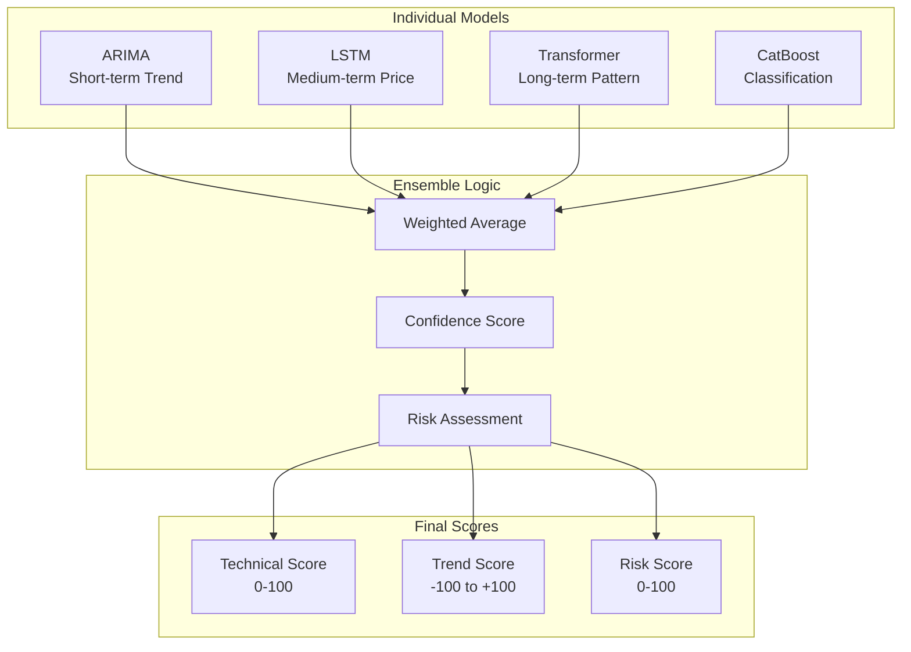
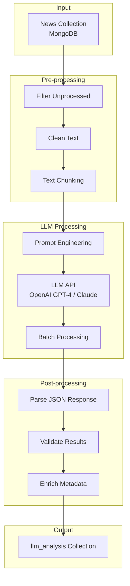
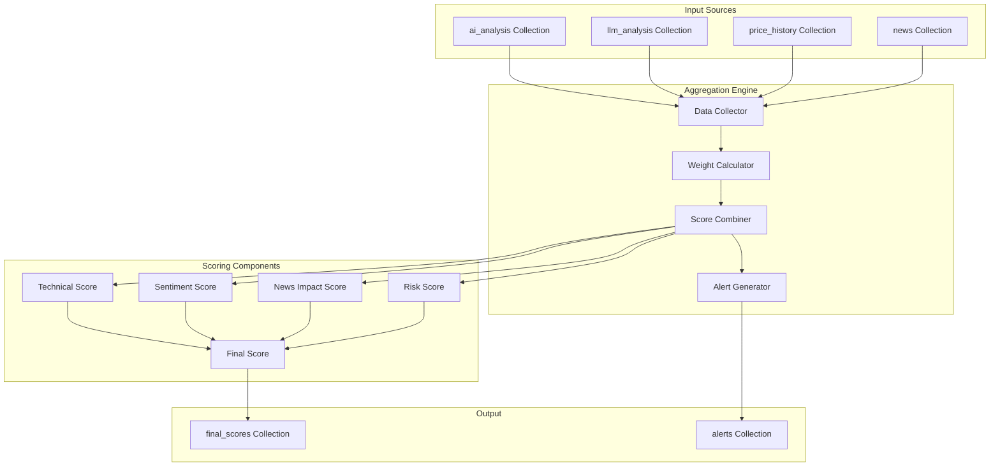

# Kế hoạch Thiết kế Hệ thống Backend - Phần 2

## Mục lục
- [3.4.4 CatBoost Model](#344-catboost-model)
- [3.5 Ensemble & Scoring](#35-ensemble--scoring)
- [4. LLM News Analysis Engine](#4-llm-news-analysis-engine)
- [5. Aggregation & Scoring Service](#5-aggregation--scoring-service)
- [6. API Layer](#6-api-layer)
- [7. Non-functional Requirements](#7-non-functional-requirements)
- [8. Deployment Plan](#8-deployment-plan)
- [9. Roadmap phát triển 3 tháng](#9-roadmap-phát-triển-3-tháng)

---

## 3.4.4 CatBoost Model

**Mục đích:**
- Phân loại xu hướng (BUY/HOLD/SELL)
- Sử dụng tất cả technical indicators và patterns
- Robust với categorical features

**Features:**
- Technical indicators (50+ features)
- Candle patterns (20+ features)
- Volume indicators (10+ features)
- Market regime indicators
- Sector/industry features

**Training:**
```python
import catboost as cb

def train_catboost_model(X_train, y_train):
    # Create labels: 0=SELL, 1=HOLD, 2=BUY
    y_labels = create_labels_from_returns(y_train)
    
    model = cb.CatBoostClassifier(
        iterations=1000,
        learning_rate=0.1,
        depth=6,
        loss_function='MultiClass',
        eval_metric='Accuracy',
        random_seed=42,
        verbose=100
    )
    
    model.fit(
        X_train, y_labels,
        eval_set=(X_val, y_val),
        early_stopping_rounds=50
    )
    
    return model

def create_labels_from_returns(returns):
    """Create labels based on future returns"""
    labels = []
    for ret in returns:
        if ret > 0.02:  # > 2%
            labels.append(2)  # BUY
        elif ret < -0.02:  # < -2%
            labels.append(0)  # SELL
        else:
            labels.append(1)  # HOLD
    return labels
```

**Feature Importance Analysis:**
```python
def analyze_feature_importance(model, feature_names):
    importance = model.get_feature_importance()
    
    feature_importance_df = pd.DataFrame({
        'feature': feature_names,
        'importance': importance
    }).sort_values('importance', ascending=False)
    
    return feature_importance_df
```

### 3.5 Ensemble & Scoring

#### **3.5.1 Model Ensemble Strategy**



**Ensemble Weights:**
```python
def calculate_ensemble_prediction(arima_pred, lstm_pred, transformer_pred, catboost_pred):
    """
    Weighted ensemble của các models
    """
    weights = {
        'arima': 0.2,      # Short-term trend
        'lstm': 0.3,       # Medium-term price
        'transformer': 0.3, # Long-term pattern  
        'catboost': 0.2    # Classification confidence
    }
    
    # Normalize predictions to same scale
    arima_norm = normalize_prediction(arima_pred, method='price_change')
    lstm_norm = normalize_prediction(lstm_pred, method='price_change') 
    transformer_norm = normalize_prediction(transformer_pred, method='price_change')
    catboost_norm = normalize_prediction(catboost_pred, method='classification')
    
    ensemble_score = (
        weights['arima'] * arima_norm +
        weights['lstm'] * lstm_norm +
        weights['transformer'] * transformer_norm +
        weights['catboost'] * catboost_norm
    )
    
    return ensemble_score
```

#### **3.5.2 Score Calculation**

**Technical Score (0-100):**
```python
def calculate_technical_score(predictions, confidence_scores, indicators):
    """
    Technical Score dựa trên:
    - Model predictions
    - Technical indicators strength  
    - Pattern confidence
    """
    # Base score from ensemble prediction
    base_score = predictions['ensemble_score']
    
    # Technical indicators score
    tech_score = (
        indicators['rsi_score'] * 0.2 +
        indicators['macd_score'] * 0.2 +
        indicators['bb_score'] * 0.2 +
        indicators['volume_score'] * 0.2 +
        indicators['pattern_score'] * 0.2
    )
    
    # Combine with confidence weighting
    technical_score = (
        base_score * 0.7 + 
        tech_score * 0.3
    ) * confidence_scores['overall_confidence']
    
    return max(0, min(100, technical_score))
```

**Trend Score (-100 to +100):**
```python
def calculate_trend_score(short_term_trend, medium_term_trend, long_term_trend):
    """
    Trend Score:
    - Positive: Bullish trend
    - Negative: Bearish trend
    - Zero: Sideways
    """
    trend_score = (
        short_term_trend * 0.5 +   # 1-5 days
        medium_term_trend * 0.3 +  # 5-20 days  
        long_term_trend * 0.2      # 20+ days
    )
    
    return max(-100, min(100, trend_score))
```

**Risk Score (0-100):**
```python
def calculate_risk_score(volatility, drawdown, beta, liquidity):
    """
    Risk Score càng cao càng rủi ro:
    - Volatility (30%)
    - Maximum Drawdown (25%)
    - Beta vs VN-Index (25%)
    - Liquidity Risk (20%)
    """
    vol_score = min(100, volatility * 100)  # Normalized volatility
    dd_score = min(100, abs(drawdown) * 100)  # Max drawdown
    beta_score = min(100, abs(beta - 1) * 50)  # Beta deviation from 1
    liq_score = liquidity_risk_score(liquidity)  # Custom liquidity scoring
    
    risk_score = (
        vol_score * 0.30 +
        dd_score * 0.25 +
        beta_score * 0.25 +
        liq_score * 0.20
    )
    
    return max(0, min(100, risk_score))
```

#### **3.5.3 MongoDB Schema: `ai_analysis` Collection**

```javascript
{
  "_id": ObjectId("..."),
  "symbol": "VNM",
  "analysis_date": ISODate("2025-12-04T09:30:00Z"),
  "data_period": {
    "from": ISODate("2025-09-04T00:00:00Z"),
    "to": ISODate("2025-12-04T00:00:00Z"),
    "days_count": 90
  },
  
  // Individual Model Results
  "models": {
    "arima": {
      "prediction": [86.2, 86.5, 86.8, 87.0, 87.3],
      "confidence": 0.75,
      "mae": 0.85,
      "parameters": "(5,1,2)"
    },
    "lstm": {
      "prediction": [86.1, 86.4, 87.0, 87.2, 87.8],
      "confidence": 0.82,
      "mae": 0.72,
      "loss": 0.0045
    },
    "transformer": {
      "prediction": [86.0, 86.3, 86.9, 87.1, 87.5],
      "confidence": 0.88,
      "mae": 0.68,
      "attention_weights": [...]
    },
    "catboost": {
      "prediction_class": 2, // 0=SELL, 1=HOLD, 2=BUY
      "class_probabilities": [0.15, 0.25, 0.60],
      "confidence": 0.85,
      "feature_importance": {...}
    }
  },
  
  // Ensemble Results
  "ensemble": {
    "prediction": [86.1, 86.4, 86.9, 87.1, 87.5],
    "weights": {
      "arima": 0.2,
      "lstm": 0.3,
      "transformer": 0.3,
      "catboost": 0.2
    },
    "overall_confidence": 0.83
  },
  
  // Technical Analysis
  "technical_indicators": {
    "rsi_14": 65.2,
    "macd": 0.85,
    "macd_signal": 0.72,
    "bb_position": 0.68, // Position within Bollinger Bands
    "atr_14": 1.25,
    "obv_trend": "bullish"
  },
  
  "patterns": {
    "detected": ["bullish_engulfing", "hammer"],
    "strength": 0.75
  },
  
  // Final Scores
  "scores": {
    "technical_score": 78.5,
    "trend_score": 45.2,
    "risk_score": 35.8,
    "recommendation": "BUY" // BUY/HOLD/SELL
  },
  
  // Performance Metrics
  "performance": {
    "accuracy_1d": 0.68,
    "accuracy_5d": 0.72,
    "sharpe_ratio": 1.45,
    "max_drawdown": 0.08
  },
  
  "created_at": ISODate("2025-12-04T09:30:00Z"),
  "updated_at": ISODate("2025-12-04T09:30:00Z")
}
```

**Indexes:**
```javascript
db.ai_analysis.createIndex({ "symbol": 1, "analysis_date": -1 })
db.ai_analysis.createIndex({ "analysis_date": -1 })
db.ai_analysis.createIndex({ "scores.technical_score": -1 })
db.ai_analysis.createIndex({ "scores.recommendation": 1 })
```

---

## 4. LLM News Analysis Engine

### 4.1 Tổng quan

LLM News Analysis Engine phân tích tin tức để:
- Tóm tắt nội dung tin tức
- Phân tích sentiment (tích cực/tiêu cực/trung tính)
- Đánh giá độ ảnh hưởng đến giá cổ phiếu
- Trích xuất insights và events quan trọng

### 4.2 Kiến trúc LLM Engine



### 4.3 Text Pre-processing

#### **4.3.1 Text Cleaning**

```python
import re
import unicodedata

def clean_news_text(text):
    """
    Làm sạch nội dung tin tức
    """
    # Remove HTML tags
    text = re.sub(r'<[^>]+>', '', text)
    
    # Remove extra whitespace
    text = re.sub(r'\s+', ' ', text)
    
    # Remove special characters but keep Vietnamese
    text = re.sub(r'[^\w\s\u00C0-\u1EF9]', '', text)
    
    # Normalize Unicode (Vietnamese)
    text = unicodedata.normalize('NFC', text)
    
    # Remove URLs
    text = re.sub(r'http[s]?://(?:[a-zA-Z]|[0-9]|[$-_@.&+]|[!*\\(\\),]|(?:%[0-9a-fA-F][0-9a-fA-F]))+', '', text)
    
    return text.strip()

def extract_key_information(text):
    """
    Trích xuất thông tin quan trọng
    """
    # Extract financial numbers
    financial_numbers = re.findall(r'\d+[.,]\d+\s*(tỷ|triệu|nghìn|%)', text)
    
    # Extract dates
    dates = re.findall(r'\d{1,2}[/\-]\d{1,2}[/\-]\d{2,4}', text)
    
    # Extract company names (capitalize words)
    companies = re.findall(r'\b[A-Z]{2,5}\b', text)
    
    return {
        'financial_numbers': financial_numbers,
        'dates': dates,
        'companies': companies
    }
```

#### **4.3.2 Text Chunking**

```python
def chunk_text_for_llm(text, max_tokens=3000):
    """
    Chia text thành chunks phù hợp với LLM context window
    """
    sentences = text.split('.')
    chunks = []
    current_chunk = ""
    
    for sentence in sentences:
        # Estimate tokens (rough: 1 token ~ 4 characters for Vietnamese)
        estimated_tokens = len(current_chunk + sentence) // 4
        
        if estimated_tokens > max_tokens and current_chunk:
            chunks.append(current_chunk.strip())
            current_chunk = sentence
        else:
            current_chunk += sentence + "."
    
    if current_chunk:
        chunks.append(current_chunk.strip())
    
    return chunks
```

### 4.4 LLM Prompt Engineering

#### **4.4.1 Sentiment Analysis Prompt**

```python
SENTIMENT_PROMPT = """
Bạn là một chuyên gia phân tích thị trường chứng khoán Việt Nam. 
Phân tích sentiment của tin tức sau đối với cổ phiếu {symbol}.

Tin tức: {news_content}

Hãy trả lời dưới dạng JSON với format sau:
{{
    "sentiment": "positive/negative/neutral",
    "confidence": 0.0-1.0,
    "reasoning": "Giải thích ngắn gọn",
    "key_factors": ["factor1", "factor2", "factor3"],
    "impact_score": 0-100,
    "time_horizon": "short_term/medium_term/long_term"
}}

Lưu ý:
- sentiment: positive (tích cực cho giá), negative (tiêu cực cho giá), neutral (không ảnh hưởng)
- confidence: độ tin cậy của phân tích (0.0 = không chắc, 1.0 = rất chắc)  
- impact_score: mức độ ảnh hưởng đến giá cổ phiếu (0 = không ảnh hưởng, 100 = ảnh hưởng rất lớn)
- time_horizon: thời gian ảnh hưởng (short_term: <1 tháng, medium_term: 1-6 tháng, long_term: >6 tháng)
"""

def create_sentiment_prompt(symbol, news_content):
    return SENTIMENT_PROMPT.format(
        symbol=symbol,
        news_content=news_content[:4000]  # Limit content length
    )
```

#### **4.4.2 Summary & Insights Prompt**

```python
SUMMARY_PROMPT = """
Bạn là một chuyên gia phân tích tài chính. Hãy tóm tắt tin tức sau và trích xuất insights quan trọng cho nhà đầu tư.

Tin tức về {symbol}: {news_content}

Trả lời dưới dạng JSON:
{{
    "summary": "Tóm tắt 2-3 câu",
    "key_insights": [
        {{
            "insight": "Insight 1",
            "importance": "high/medium/low",
            "category": "financial/operational/market/regulatory"
        }}
    ],
    "financial_impacts": [
        {{
            "metric": "revenue/profit/eps/etc",
            "direction": "increase/decrease/stable",
            "magnitude": "slight/moderate/significant"
        }}
    ],
    "investment_recommendation": {{
        "action": "buy/hold/sell/watch",
        "reasoning": "Lý do ngắn gọn",
        "risk_factors": ["risk1", "risk2"]
    }}
}}
"""

def create_summary_prompt(symbol, news_content):
    return SUMMARY_PROMPT.format(
        symbol=symbol,
        news_content=news_content[:4000]
    )
```

### 4.5 LLM API Integration

#### **4.5.1 OpenAI GPT-4 Integration**

```python
import openai
import json
import time
from typing import Dict, Any

class LLMAnalyzer:
    def __init__(self, api_key: str, model: str = "gpt-4"):
        self.client = openai.OpenAI(api_key=api_key)
        self.model = model
        
    async def analyze_news_sentiment(self, symbol: str, news_content: str) -> Dict[str, Any]:
        """
        Phân tích sentiment của tin tức
        """
        prompt = create_sentiment_prompt(symbol, news_content)
        
        try:
            response = await self.client.chat.completions.acreate(
                model=self.model,
                messages=[
                    {"role": "system", "content": "You are a Vietnamese stock market analyst."},
                    {"role": "user", "content": prompt}
                ],
                temperature=0.1,  # Low temperature for consistent results
                max_tokens=1000,
                response_format={"type": "json_object"}
            )
            
            result = json.loads(response.choices[0].message.content)
            return result
            
        except Exception as e:
            print(f"Error in sentiment analysis: {e}")
            return self._get_default_sentiment()
    
    async def analyze_news_summary(self, symbol: str, news_content: str) -> Dict[str, Any]:
        """
        Tóm tắt và trích xuất insights
        """
        prompt = create_summary_prompt(symbol, news_content)
        
        try:
            response = await self.client.chat.completions.acreate(
                model=self.model,
                messages=[
                    {"role": "system", "content": "You are a Vietnamese financial analyst."},
                    {"role": "user", "content": prompt}
                ],
                temperature=0.2,
                max_tokens=1500,
                response_format={"type": "json_object"}
            )
            
            result = json.loads(response.choices[0].message.content)
            return result
            
        except Exception as e:
            print(f"Error in summary analysis: {e}")
            return self._get_default_summary()
    
    def _get_default_sentiment(self):
        return {
            "sentiment": "neutral",
            "confidence": 0.0,
            "reasoning": "Error in analysis",
            "key_factors": [],
            "impact_score": 0,
            "time_horizon": "short_term"
        }
    
    def _get_default_summary(self):
        return {
            "summary": "Error in analysis",
            "key_insights": [],
            "financial_impacts": [],
            "investment_recommendation": {
                "action": "watch",
                "reasoning": "Error in analysis",
                "risk_factors": []
            }
        }
```

#### **4.5.2 Batch Processing**

```python
import asyncio
from typing import List

class BatchLLMProcessor:
    def __init__(self, llm_analyzer: LLMAnalyzer, batch_size: int = 5):
        self.llm_analyzer = llm_analyzer
        self.batch_size = batch_size
        
    async def process_news_batch(self, news_items: List[Dict]) -> List[Dict]:
        """
        Xử lý batch news với rate limiting
        """
        results = []
        
        for i in range(0, len(news_items), self.batch_size):
            batch = news_items[i:i + self.batch_size]
            
            # Process batch concurrently
            tasks = []
            for news_item in batch:
                task = self._process_single_news(news_item)
                tasks.append(task)
            
            batch_results = await asyncio.gather(*tasks, return_exceptions=True)
            
            # Handle results and exceptions
            for result in batch_results:
                if isinstance(result, Exception):
                    print(f"Error processing news: {result}")
                    continue
                results.append(result)
            
            # Rate limiting - wait between batches
            await asyncio.sleep(1)  # 1 second between batches
        
        return results
    
    async def _process_single_news(self, news_item: Dict) -> Dict:
        """
        Xử lý một tin tức
        """
        symbol = news_item['symbol']
        content = news_item['content']
        
        # Analyze sentiment and summary concurrently
        sentiment_task = self.llm_analyzer.analyze_news_sentiment(symbol, content)
        summary_task = self.llm_analyzer.analyze_news_summary(symbol, content)
        
        sentiment_result, summary_result = await asyncio.gather(
            sentiment_task, summary_task, return_exceptions=True
        )
        
        return {
            'news_id': news_item['news_id'],
            'symbol': symbol,
            'sentiment_analysis': sentiment_result if not isinstance(sentiment_result, Exception) else None,
            'summary_analysis': summary_result if not isinstance(summary_result, Exception) else None,
            'processed_at': time.time()
        }
```

### 4.6 MongoDB Schema: `llm_analysis` Collection

```javascript
{
  "_id": ObjectId("..."),
  "news_id": "hash_abc123",
  "symbol": "VNM", 
  "analysis_date": ISODate("2025-12-04T10:00:00Z"),
  
  // Original news info
  "news_reference": {
    "title": "VNM công bố kế hoạch tăng vốn điều lệ",
    "published_at": ISODate("2025-12-04T08:30:00Z"),
    "source_url": "https://..."
  },
  
  // LLM Sentiment Analysis
  "sentiment_analysis": {
    "sentiment": "positive",
    "confidence": 0.85,
    "reasoning": "Tin tức về tăng vốn điều lệ thường tích cực cho triển vọng tăng trưởng",
    "key_factors": ["tăng vốn điều lệ", "mở rộng sản xuất", "kế hoạch đầu tư"],
    "impact_score": 75,
    "time_horizon": "medium_term"
  },
  
  // LLM Summary & Insights  
  "summary_analysis": {
    "summary": "VNM thông báo kế hoạch tăng vốn điều lệ 20% để mở rộng nhà máy và đầu tư công nghệ mới.",
    "key_insights": [
      {
        "insight": "Kế hoạch mở rộng sản xuất tại miền Bắc",
        "importance": "high",
        "category": "operational"
      },
      {
        "insight": "Đầu tư 500 tỷ vào công nghệ tự động hóa", 
        "importance": "medium",
        "category": "financial"
      }
    ],
    "financial_impacts": [
      {
        "metric": "revenue",
        "direction": "increase", 
        "magnitude": "moderate"
      },
      {
        "metric": "eps",
        "direction": "increase",
        "magnitude": "slight"
      }
    ],
    "investment_recommendation": {
      "action": "buy",
      "reasoning": "Kế hoạch mở rộng tích cực, tăng trưởng bền vững",
      "risk_factors": ["rủi ro thị trường", "cạnh tranh ngành sữa"]
    }
  },
  
  // Processing metadata
  "processing_info": {
    "llm_model": "gpt-4",
    "processing_time_ms": 2500,
    "tokens_used": 1250,
    "api_cost_usd": 0.035,
    "retry_count": 0,
    "quality_score": 0.92
  },
  
  "created_at": ISODate("2025-12-04T10:00:00Z"),
  "updated_at": ISODate("2025-12-04T10:00:00Z")
}
```

**Indexes:**
```javascript
db.llm_analysis.createIndex({ "news_id": 1 }, { unique: true })
db.llm_analysis.createIndex({ "symbol": 1, "analysis_date": -1 })
db.llm_analysis.createIndex({ "sentiment_analysis.sentiment": 1 })
db.llm_analysis.createIndex({ "sentiment_analysis.impact_score": -1 })
```

---

## 5. Aggregation & Scoring Service

### 5.1 Tổng quan

Aggregation & Scoring Service kết hợp:
- Phân tích AI/ML (định lượng)
- Phân tích LLM (định tính) 
- Tạo ra điểm số cuối cùng và cảnh báo

### 5.2 Kiến trúc Aggregation Service



### 5.3 Score Calculation Logic

#### **5.3.1 Technical Score (0-100)**

```python
def calculate_technical_score(ai_analysis: Dict) -> float:
    """
    Technical Score từ AI/ML analysis
    """
    if not ai_analysis:
        return 50.0  # Neutral score
    
    scores = ai_analysis.get('scores', {})
    technical_score = scores.get('technical_score', 50.0)
    
    # Adjust based on model confidence
    confidence = ai_analysis.get('ensemble', {}).get('overall_confidence', 0.5)
    
    # Weight by confidence - low confidence moves toward neutral (50)
    adjusted_score = technical_score * confidence + 50.0 * (1 - confidence)
    
    return max(0, min(100, adjusted_score))
```

#### **5.3.2 Sentiment Score (0-100)**

```python
def calculate_sentiment_score(llm_analyses: List[Dict]) -> float:
    """
    Sentiment Score từ LLM news analysis
    """
    if not llm_analyses:
        return 50.0  # Neutral
    
    weighted_sentiment = 0.0
    total_weight = 0.0
    
    for analysis in llm_analyses:
        sentiment_data = analysis.get('sentiment_analysis', {})
        
        sentiment = sentiment_data.get('sentiment', 'neutral')
        confidence = sentiment_data.get('confidence', 0.0)
        impact_score = sentiment_data.get('impact_score', 0)
        
        # Convert sentiment to numeric score
        if sentiment == 'positive':
            sentiment_numeric = 75.0
        elif sentiment == 'negative':
            sentiment_numeric = 25.0
        else:  # neutral
            sentiment_numeric = 50.0
        
        # Weight by confidence and impact
        weight = confidence * (impact_score / 100.0)
        weighted_sentiment += sentiment_numeric * weight
        total_weight += weight
    
    if total_weight == 0:
        return 50.0
    
    final_sentiment_score = weighted_sentiment / total_weight
    return max(0, min(100, final_sentiment_score))
```

#### **5.3.3 News Impact Score (0-100)**

```python
def calculate_news_impact_score(llm_analyses: List[Dict], time_decay_days: int = 7) -> float:
    """
    News Impact Score với time decay
    """
    if not llm_analyses:
        return 0.0
    
    current_time = datetime.now()
    total_impact = 0.0
    
    for analysis in llm_analyses:
        analysis_date = analysis.get('analysis_date')
        if not analysis_date:
            continue
        
        # Time decay factor
        days_ago = (current_time - analysis_date).days
        decay_factor = max(0, 1 - (days_ago / time_decay_days))
        
        # Impact score from LLM
        sentiment_data = analysis.get('sentiment_analysis', {})
        impact_score = sentiment_data.get('impact_score', 0)
        confidence = sentiment_data.get('confidence', 0)
        
        # Weighted impact with time decay
        weighted_impact = impact_score * confidence * decay_factor
        total_impact += weighted_impact
    
    # Normalize to 0-100
    normalized_impact = min(100, total_impact)
    return normalized_impact
```

#### **5.3.4 Final Score Calculation**

```python
def calculate_final_score(
    technical_score: float,
    sentiment_score: float, 
    news_impact_score: float,
    risk_score: float
) -> Dict[str, Any]:
    """
    Tính Final Score và recommendation
    """
    # Weights for different components
    weights = {
        'technical': 0.40,    # Technical analysis (most important)
        'sentiment': 0.25,    # News sentiment
        'news_impact': 0.20,  # News impact
        'risk_adjustment': 0.15  # Risk factor
    }
    
    # Calculate base score
    base_score = (
        technical_score * weights['technical'] +
        sentiment_score * weights['sentiment'] + 
        news_impact_score * weights['news_impact']
    )
    
    # Risk adjustment - high risk reduces final score
    risk_penalty = (risk_score / 100.0) * weights['risk_adjustment'] * 100
    final_score = base_score - risk_penalty
    
    # Ensure score is in range [0, 100]
    final_score = max(0, min(100, final_score))
    
    # Generate recommendation
    recommendation = generate_recommendation(
        final_score, technical_score, sentiment_score, risk_score
    )
    
    return {
        'final_score': final_score,
        'recommendation': recommendation['action'],
        'confidence': recommendation['confidence'],
        'breakdown': {
            'technical_score': technical_score,
            'sentiment_score': sentiment_score,
            'news_impact_score': news_impact_score,
            'risk_score': risk_score,
            'risk_penalty': risk_penalty
        }
    }

def generate_recommendation(final_score: float, technical_score: float, 
                          sentiment_score: float, risk_score: float) -> Dict[str, Any]:
    """
    Generate BUY/WATCH/SELL recommendation
    """
    # Base recommendation from final score
    if final_score >= 75:
        action = "BUY"
        confidence = min(0.95, final_score / 100.0 + 0.2)
    elif final_score >= 60:
        action = "WATCH"
        confidence = 0.7
    elif final_score >= 40:
        action = "WATCH"
        confidence = 0.6
    else:
        action = "SELL"
        confidence = min(0.95, (100 - final_score) / 100.0 + 0.2)
    
    # Risk override - high risk downgrades recommendation
    if risk_score > 80:
        if action == "BUY":
            action = "WATCH"
            confidence *= 0.8
        elif action == "WATCH" and final_score < 50:
            action = "SELL"
    
    # Technical/sentiment conflict check
    if abs(technical_score - sentiment_score) > 30:
        confidence *= 0.85  # Reduce confidence when signals conflict
    
    return {
        'action': action,
        'confidence': confidence
    }
```

### 5.4 Alert Generation

#### **5.4.1 Alert Conditions**

```python
def generate_alerts(symbol: str, current_scores: Dict, previous_scores: Dict, 
                   price_data: Dict) -> List[Dict]:
    """
    Generate alerts based on score changes and thresholds
    """
    alerts = []
    
    # Score change alerts
    score_change = current_scores['final_score'] - previous_scores.get('final_score', 50)
    
    if score_change >= 15:
        alerts.append({
            'type': 'SCORE_INCREASE',
            'severity': 'MEDIUM',
            'message': f'{symbol}: Điểm số tăng mạnh {score_change:.1f} điểm',
            'details': {
                'current_score': current_scores['final_score'],
                'previous_score': previous_scores.get('final_score', 50),
                'change': score_change
            }
        })
    
    elif score_change <= -15:
        alerts.append({
            'type': 'SCORE_DECREASE', 
            'severity': 'HIGH',
            'message': f'{symbol}: Điểm số giảm mạnh {abs(score_change):.1f} điểm',
            'details': {
                'current_score': current_scores['final_score'],
                'previous_score': previous_scores.get('final_score', 50),
                'change': score_change
            }
        })
    
    # Recommendation change alerts
    current_rec = current_scores['recommendation']
    previous_rec = previous_scores.get('recommendation', 'WATCH')
    
    if current_rec != previous_rec:
        severity = 'HIGH' if current_rec in ['BUY', 'SELL'] else 'MEDIUM'
        alerts.append({
            'type': 'RECOMMENDATION_CHANGE',
            'severity': severity,
            'message': f'{symbol}: Khuyến nghị thay đổi từ {previous_rec} thành {current_rec}',
            'details': {
                'current_recommendation': current_rec,
                'previous_recommendation': previous_rec,
                'confidence': current_scores['confidence']
            }
        })
    
    # Risk alerts
    risk_score = current_scores['breakdown']['risk_score']
    if risk_score > 85:
        alerts.append({
            'type': 'HIGH_RISK',
            'severity': 'HIGH',
            'message': f'{symbol}: Mức rủi ro cao ({risk_score:.1f}/100)',
            'details': {
                'risk_score': risk_score,
                'risk_factors': get_risk_factors(symbol)
            }
        })
    
    # Price movement alerts (if available)
    if price_data:
        price_change_pct = price_data.get('change_percent', 0)
        if abs(price_change_pct) > 5:
            severity = 'HIGH' if abs(price_change_pct) > 7 else 'MEDIUM'
            alerts.append({
                'type': 'PRICE_MOVEMENT',
                'severity': severity,
                'message': f'{symbol}: Giá thay đổi {price_change_pct:+.1f}%',
                'details': {
                    'price_change_percent': price_change_pct,
                    'current_price': price_data.get('current_price'),
                    'previous_price': price_data.get('previous_price')
                }
            })
    
    return alerts
```

### 5.5 MongoDB Schemas

#### **5.5.1 `final_scores` Collection**

```javascript
{
  "_id": ObjectId("..."),
  "symbol": "VNM",
  "calculation_date": ISODate("2025-12-04T11:00:00Z"),
  
  // Input data references
  "input_references": {
    "ai_analysis_id": ObjectId("..."),
    "llm_analysis_ids": [ObjectId("..."), ObjectId("...")],
    "price_data_timestamp": ISODate("2025-12-04T10:45:00Z")
  },
  
  // Final scores and recommendation
  "scores": {
    "final_score": 78.5,
    "recommendation": "BUY",
    "confidence": 0.82,
    "breakdown": {
      "technical_score": 75.2,
      "sentiment_score": 85.3,
      "news_impact_score": 68.7,
      "risk_score": 32.1,
      "risk_penalty": 4.8
    }
  },
  
  // Detailed breakdown
  "components": {
    "technical_analysis": {
      "trend_score": 45.2,
      "pattern_strength": 0.75,
      "model_confidence": 0.83
    },
    "sentiment_analysis": {
      "positive_news_count": 3,
      "negative_news_count": 0,
      "neutral_news_count": 1,
      "weighted_sentiment": 0.78
    },
    "news_impact": {
      "total_news_analyzed": 4,
      "avg_impact_score": 68.7,
      "time_decay_applied": true
    },
    "risk_analysis": {
      "volatility_score": 35.0,
      "liquidity_score": 25.0,
      "beta_score": 30.0,
      "overall_risk": 32.1
    }
  },
  
  // Weights used in calculation
  "calculation_weights": {
    "technical": 0.40,
    "sentiment": 0.25,
    "news_impact": 0.20,
    "risk_adjustment": 0.15
  },
  
  // Metadata
  "metadata": {
    "calculation_version": "v2.1",
    "processing_time_ms": 1250,
    "data_quality_score": 0.89,
    "alerts_generated": 2
  },
  
  "created_at": ISODate("2025-12-04T11:00:00Z"),
  "updated_at": ISODate("2025-12-04T11:00:00Z")
}
```

#### **5.5.2 `alerts` Collection**

```javascript
{
  "_id": ObjectId("..."),
  "symbol": "VNM",
  "alert_type": "RECOMMENDATION_CHANGE",
  "severity": "HIGH", // HIGH, MEDIUM, LOW
  "status": "ACTIVE", // ACTIVE, ACKNOWLEDGED, RESOLVED
  
  // Alert content
  "message": "VNM: Khuyến nghị thay đổi từ WATCH thành BUY",
  "details": {
    "current_recommendation": "BUY",
    "previous_recommendation": "WATCH", 
    "confidence": 0.82,
    "trigger_score": 78.5
  },
  
  // Timing
  "triggered_at": ISODate("2025-12-04T11:00:00Z"),
  "expires_at": ISODate("2025-12-05T11:00:00Z"), // Auto-expire after 24h
  
  // References
  "score_reference": ObjectId("..."), // Link to final_scores
  "trigger_conditions": {
    "score_threshold": 75.0,
    "confidence_threshold": 0.8,
    "previous_recommendation": "WATCH"
  },
  
  // Actions taken
  "notifications_sent": [
    {
      "channel": "email",
      "status": "sent",
      "sent_at": ISODate("2025-12-04T11:01:00Z")
    },
    {
      "channel": "webhook",
      "status": "pending",
      "retry_count": 1
    }
  ],
  
  "created_at": ISODate("2025-12-04T11:00:00Z"),
  "updated_at": ISODate("2025-12-04T11:00:00Z")
}
```

**Indexes:**
```javascript
// final_scores indexes
db.final_scores.createIndex({ "symbol": 1, "calculation_date": -1 })
db.final_scores.createIndex({ "scores.final_score": -1 })
db.final_scores.createIndex({ "scores.recommendation": 1 })

// alerts indexes  
db.alerts.createIndex({ "symbol": 1, "triggered_at": -1 })
db.alerts.createIndex({ "status": 1, "severity": 1 })
db.alerts.createIndex({ "alert_type": 1 })
db.alerts.createIndex({ "triggered_at": -1 })
```

---

_Tiếp tục đọc plan2.md để xem phần API Layer, Deployment Plan và Roadmap..._